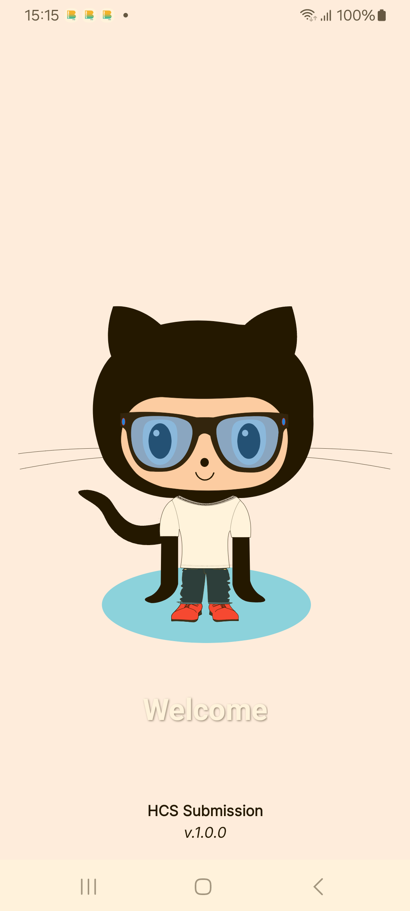
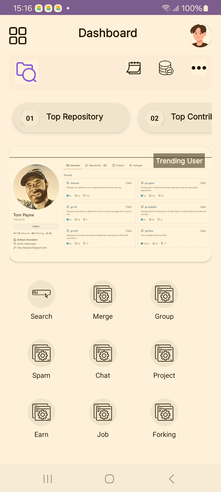
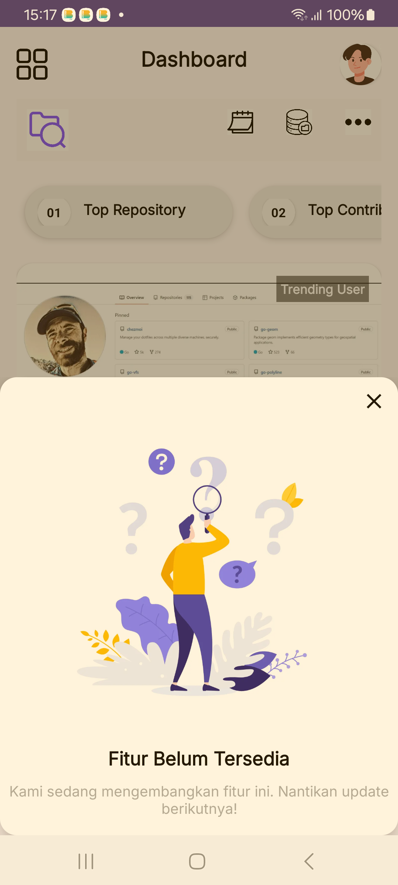
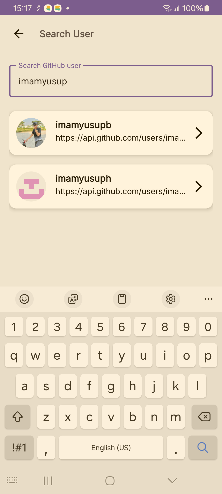
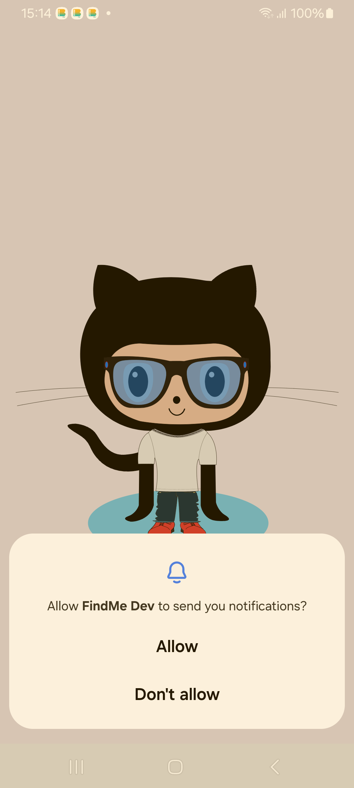
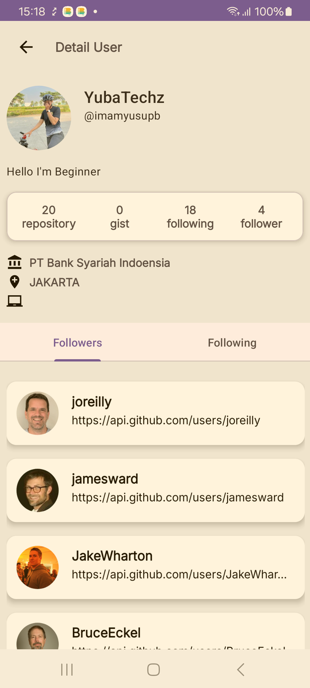

# 📱 FindMeDev

FindMeDev adalah aplikasi Android untuk mencari pengguna GitHub dan melihat detail profil mereka.  
Berikut adalah tampilan layar dari aplikasi ini:

---

## 🖼️ Screenshots

| Splash Screen | Onboarding 1 | Onboarding 2 | Onboarding 3 |
|--------------|--------------|--------------|--------------|
|  |  |  |  |

| Dashboard | Drawer | Search User | Notifications |
|----------|--------|-------------|---------------|
|  |  |  |  |

| Detail User |
|------------|
|  |

---

## ⚙️ Tech Stack
- **Language:** Kotlin
- **UI:** XML, ViewBinding
- **Architecture:** MVVM + Clean Architecture
- **Dependency Injection:** Hilt
- **Networking:** Retrofit + Moshi
- **Asynchronous:** Kotlin Coroutines + Flow
- **Image Loading:** Coil

---

## 🚀 Cara Menjalankan
1. Clone repository ini:
   ```bash
   git clone https://github.com/username/FindMeDev.git
